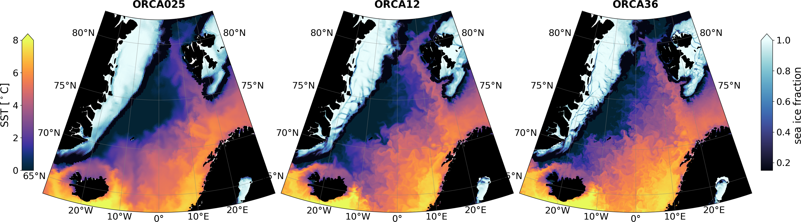

# ANR HEAT-UP
**A project funded by the French ANR to advance our understanding of the role of ocean mesoscale processes on heat transport from the subpolar regions to the sea ice in both hemispheres.**

Both the Arctic and Antarctic sea ice are currently retreating and are predicted to further shrink into the
21st century. Reductions in sea ice have major implications on the climate, the ecosystems, and on 
human societies. Reliable projections of sea ice are thus crucial to help our societies in making informed
decisions for climate change mitigation and adaptation. The sea ice retreat is due in part to the ocean that
brings relatively warm waters from the low to the high latitudes. In particular, mesoscale processes (10-
100 km) are thought to play a determining role in transporting heat towards polar regions. Yet, it remains
unclear how ocean mesoscale impacts the pathways of these warm waters en route to the poles, the
magnitude and variability of poleward heat transport, and how it contributes to transferring this heat up to
the sea ice. This knowledge gap is due to the sparsity of observations in polar regions and the limited
resolution of numerical models at high latitudes. By using high-resolution ocean-sea ice models, the
HEAT-UP project proposes to advance our understanding of the role of the ocean mesoscale on heat
transport from the subpolar regions to the sea ice in both hemispheres. This focus on the two poles will
leverage similarities between the two polar regions within a consistent methodological framework to make
advances on the characterization and quantification of the impact of mesoscale processes on heat
transport in the context of sea ice decline. Doing so, the project will inform the development of
parameterizations of mesoscale processes in ocean models and the interpretation and deployment of
observations in polar regions.

